# 信息检索实验三：企业搜索系统的设计与实现
## 1 实验目的
本次实验目的是对企业检索系统的设计与实现过程有一个全面的了解。本次实验设计的内容包括：对数据建立索引，实现文档的搜索，并对检索结果排序；实现企业搜索中的分权限访问。

## 2 实验内容
### 2.1 建立索引
本次实验使用到的数据是实验1中爬取的网页数据。首先要对1000个网页的网页内容建立索引，其次也要对爬取到的所有附件文档建立索引。然后实现一个简单的检索系统，实现数据和文档检索（可以分开实现，也可以合二为一），并且能够精确的对检索结果进行排序。这一部分要求同学们做成简单的UI应用或者是Web应用，来保证易用性。

### 3.2 分权限访问
可以自己定义多种不同的“企业角色”（至少4种），这些角色对数据或文 档的访问权限不同，然后为每条数据增加访问权限。然后在现有检索系统的基础上加入分权限访问功能，使得不同角色的用户在使用检索系统时，只能看到自己具有访问权限的那部分内容。同时在 3.1 的基础上对应用界面改进，便于切换企业角色。
分权限访问的实现一般有以下两种模式：
1. **检索条件控制**：对检索条件加以限制，仅在用户访问权限内的文档中检索。
2. **检索结果过滤**：检索结果的后处理，过滤掉用户不具备访问权限的结果。

## 3 实验过程及结果
### 3.1建立索引
首先对实验1抓取网页和文档分别构建倒排索引，供检索模型使用；另一方面根据向量空间模型计算两两网页之间的余弦相似度，供推荐模块使用。最后利用概率检索模型中的BM25公式计算给定关键词下的文档相关性评分，根据评分给出排序结果。

#### 3.1.1构建索引
在扫描文档时，不但记录某词项出现与否，还记录该词项出现的次数，即词项频率(tf)；同时我们记录该文档的长度(ld)，以及某词项在不同文档中出现的次数，即文档频率(df)。
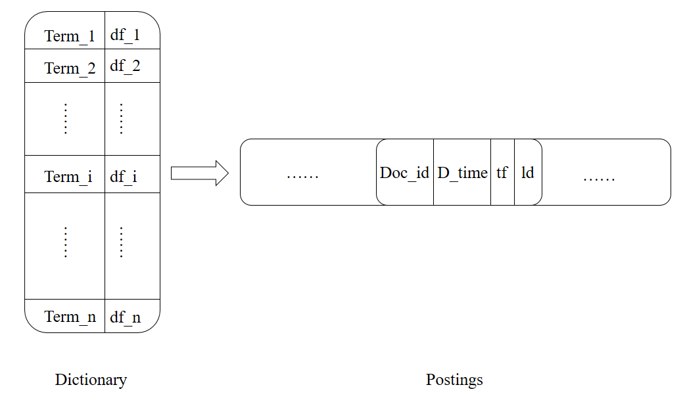

这样就得到了如上图的倒排索引。左边部分被称为词典，存储的网页和文档中所有不同的词项；右边部分被称为倒排记录表，存储的是出现Term_i的那些文档信息。倒排索引中存储的变量都是为了给后续检索模型使用。
（1）分词：jieba分词能够将一个中文句子切成一个个词项，这样就可以统计tf, df了。
（2）去停用词：有些词，如”的“、”地“、”得“、”如果“等，几乎每篇文档都会出现，他们起不到很好的区分文档的效果，这类词被称为”停用词“，我们需要把他们去掉。去停词的步骤可以在jieba分词之后完成。
（3）存储倒排记录表：用矩阵方式存储时空效率都不高。所以采用图1的方式，词典用B-树或hash存储，倒排记录表用邻接链表存储方式，这样能大大减少存储空间。如果要将图1保存到数据库，可以对倒排记录表序列化成一个长的字符串，写入到一个单元格，读取的时候再反序列化。比如每个Doc内部用'\t'连接，Doc之间用'\n'连接，读取的时候split即可。
倒排索引构建算法使用内存式单遍扫描索引构建方法（SPIMI），其实就是依次对每篇新闻进行分词，如果出现新的词项则插入到词典中，否则将该文档的信息追加到词项对应的倒排记录表中。
3.1.2 BM25检索模型
检索模型有很多，比如向量空间模型、概率模型、语言模型等。其中最有名的、检索效果最好的是基于概率的BM25模型。
给定一个查询Q和一篇文档d，d对Q的BM25得分公式为
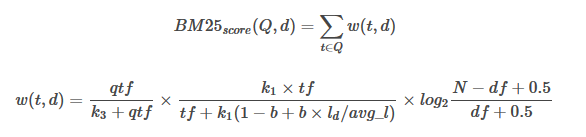
公式中变量含义如下：
- qtf ：查询中的词频
- tf ：文档中的词频
- ld ：文档长度
- avg_l ：平均文档长度
- N ：文档数量
- df ：文档频率
- b,k1,k3 ：可调参数

第一个公式是外部公式，一个查询Q可能包含多个词项，比如“苹果手机”就包含“苹果”和“手机”两个词项，我们需要分别计算“苹果”和“手机”对某个文档d的贡献分数w(t,d)，然后将他们加起来就是整个文档d相对于查询Q的得分。
第二个公式就是计算某个词项t在文档d中的得分，它包括三个部分。第一个部分是词项t在查询Q中的得分，比如查询“中国人说中国话”中“中国”出现了两次，此时qtf=2，说明这个查询希望找到的文档和“中国”更相关，“中国”的权重应该更大，但是通常情况下，查询Q都很短，而且不太可能包含相同的词项，所以这个因子是一个常数，我们在实现的时候可以忽略。第二部分类似于TFIDF模型中的TF项。也就是说某个词项t在文档d中出现次数越多，则t越重要，但是文档长度越长，tf也倾向于变大，所以使用文档长度除以平均长度ld/avg_l
起到某种归一化的效果，k1和b是可调参数。
第三部分类似于TFIDF模型中的IDF项。也就是说虽然“的”、“地”、“得”等停用词在某文档d中出现的次数很多，但是他们在很多文档中都出现过，所以这些词对d的贡献分并不高，接近于0；反而那些很稀有的词如”糖尿病“能够很好的区分不同文档，这些词对文档的贡献分应该较高。
所以根据BM25公式，我们可以很快计算出不同文档t对查询Q的得分情况，然后按得分高低排序给出结果。
首先将句子分词得到所有查询词项，然后从数据库中取出词项对应的倒排记录表，对记录表中的所有文档，计算其BM25得分，最后按得分高低排序作为查询结果。

#### 3.1.3 推荐阅读
虽然主要的检索功能实现了，但是我添加了一个“推荐阅读”的功能。当用户浏览某条具体新闻时，我在页面底端给出5条和该新闻相关的新闻，也就是一个最简单的推荐系统。
推荐模块的思路是度量两两新闻之间的相似度，取相似度最高的前5篇新闻作为推荐阅读的新闻。
一篇文档可以用一个向量表示，向量中的每个值是不同词项t在该文档d中的词频tf。但是一篇较短的文档（如新闻）的关键词并不多，所以我们可以提取每篇新闻的关键词，用这些关键词的tf-idf值构成文档的向量表示，这样能够大大减少相似度计算量，同时保持较好的推荐效果。
jieba分词组件自带关键词提取功能，并能返回关键词的tf-idf值。所以对每篇新闻，我先提取tf-idf得分最高的前25个关键词，用这25个关键词的tf-idf值作为文档的向量表示。由此能够得到一个1000*m的文档词项矩阵M，矩阵每行表示一个文档，每列表示一个词项，m为1000个文档的所有互异的关键词（大概10000个）。矩阵M当然也是稀疏矩阵。
得到文档词项矩阵M之后，利用sklearn的pairwise_distances函数计算M中行向量之间的cosine相似度，对每个文档，得到与其最相似的前5篇新闻id，并把结果写入数据库。

#### 3.1.4界面设计
利用开源的Flask Web框架搭建了展示系统，搜索引擎只需要两个界面，一个是搜索界面，另一个是展示详细新闻的页面。编写好这两个模板页面并调用前面给出的接口，得到数据，展示出来就可以。由于数据量不大，所以第一页中后面几个结果相关度就不是很高了。这里可以设置一个得分阈值，超过这个阈值才作为查询答案返回。

#### 3.1.5 实验结果
本次实验使用的数据库设计：
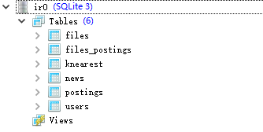

表名 | 数据
---|:--:|---:
Files | 实验1爬取的附件
Files_postings |	附件的倒排记录表
news |	实验1爬取的新闻（网页）
postings |	新闻的倒排记录表
knearest |	每篇新闻最相似的前5篇新闻id
Users |	注册的用户

网页查询结果：
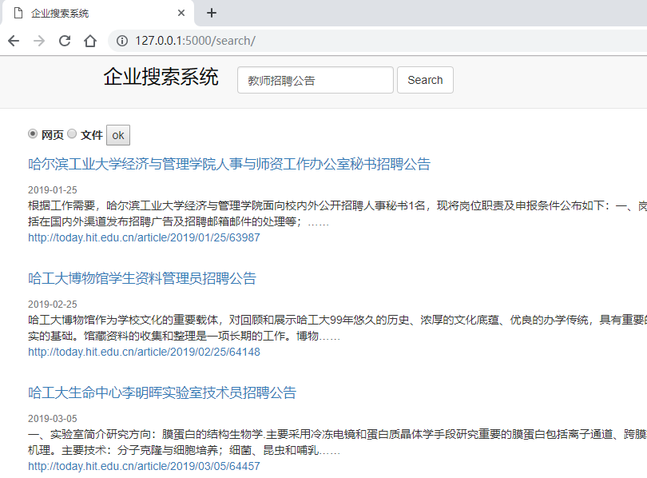

附件查询结果：
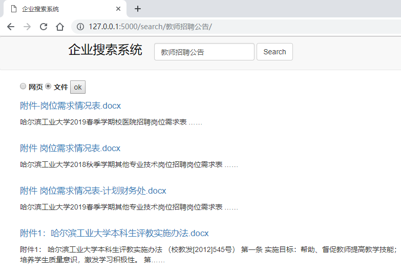

详细内容页：
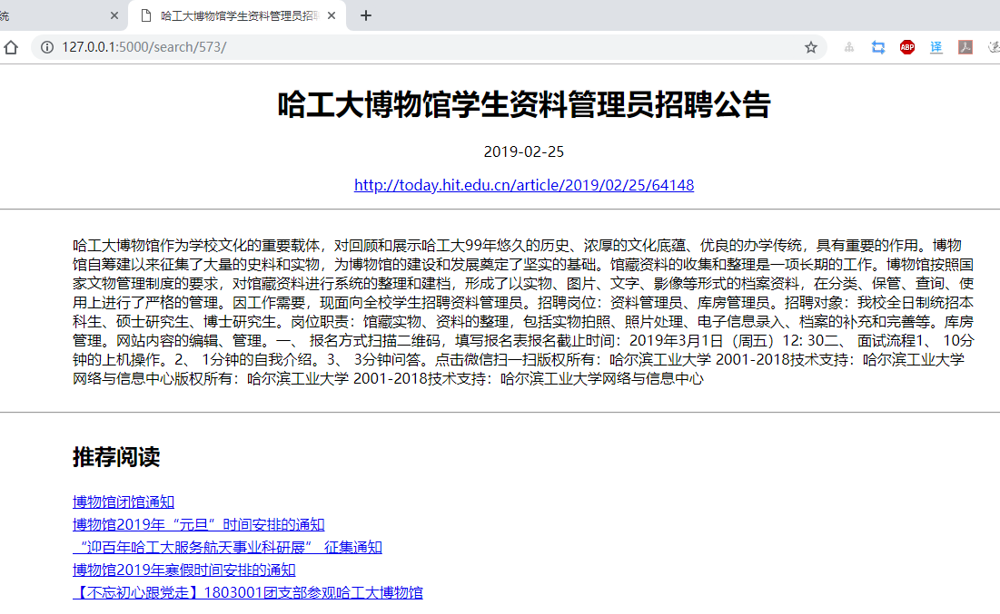

### 3.2 分权限访问
本节实验在3.1的基础上对网页和附件增加了访问权限，并增加了注册登录功能，过滤掉用户不具备访问权限的查询结果，使得不同等级的用户访问相应权限的网页和附件。

#### 3.2.1 权限划分
由于实验1抓取的网页和附件没有明显的权限界限，所以实验中只是对网页和附件的权限进行了简单的划分。“企业角色”分为1级，2级，3级，4级，级别越高访问权限越大，n级用户只能访问数据级别小于n的数据。
- 网页权限的划分：
一共1175个网页，均分为4级，每级300个
数据库截图如下：
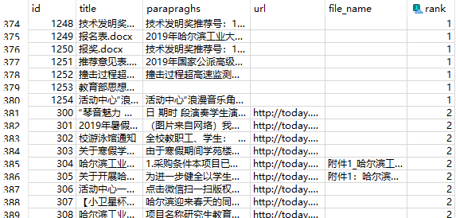

- 附件权限的划分：
一共334个附件，均分为4级，每级80个，在这节实验中，我把附件的数据库与网页的数据库合并了，从上图可以看出，id为1~380 (300+80) 属于第1级数据。
这里有一点需要注意，python不能读取.dox后缀的文件，需要将.dox批量转化为.docx，处理如下：
```
	import docx

	def doSaveAas():
    	files = listdir('D:\\Work\\IR\\Lab3\\document')
    	word = wc.Dispatch('Word.Application')
    	for item in files:
        	if 'docx' in item:
            	continue
        	if 'doc' in item:
            	doc = word.Documents.Open('D:\\Work\\IR\\Lab3\\document\\' + item)  # 目标路径下的文件
            	doc.SaveAs('D:\\Work\\IR\\Lab3\\document\\' + item + 'x', 12, False, "", True, "", False, False, False,
                       False)  # 转化后路径下的文件
            	doc.Close()
            	os.remove('D:\\Work\\IR\\Lab3\\document\\' + item)  # 删除文件
    	word.Quit()
```

3.2.2 注册登录
注册登录为用户划分了4个等级
注册页面如下：注册时需要用户声明自己的等级
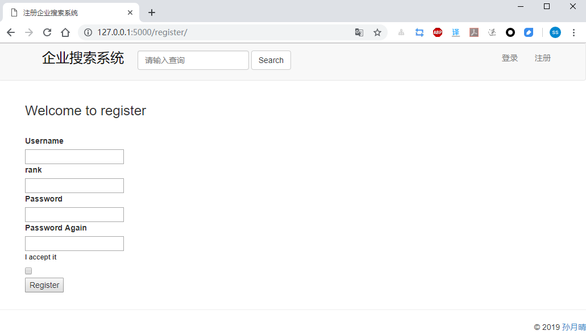

登录页面如下：
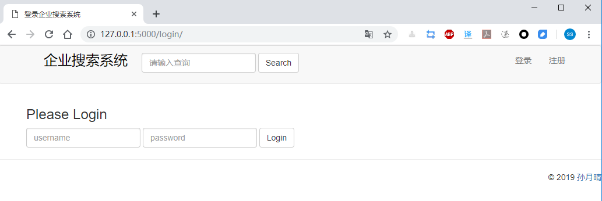

users数据库截图：
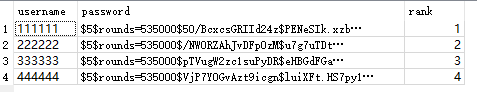

这里的password在注册时对用户的密码进行了加密，生成一个hash值
`
password = sha256_crypt.encrypt(
    str(form.password.data))  # 对密码加密,生成一个hash值[每次调用生成不同的hash]`

##### 3.2.3实验结果
等级为2的用户登录


后台打印的返回网页记录：
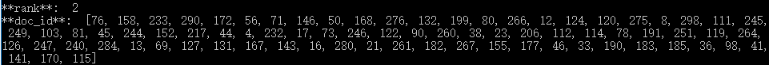
等级为4的用户登录


后台打印的返回网页记录：
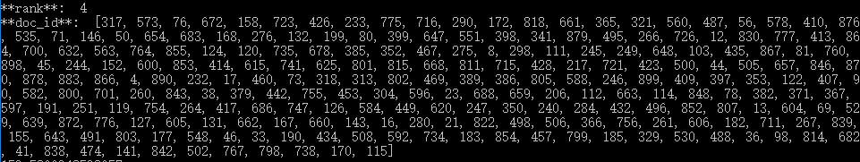
可以看出，不同等级的用户搜索系统返回的结果不同。

## 4 实验心得
至此，整个企业搜索系统构建完毕，总体效果令人满意，不过还是有很多可以改进的地方。下面总结一下本系统的优点和不足。
- 优点
倒排索引存储方式。因为不同词项的倒排记录表长度一般不同，所以没办法以常规的方式存入关系型数据库。通过将一个词项的倒排记录表序列化成一个字符串再存入数据库，读取的时候通过反序列化获得相关数据，整个结构类似于邻接表的形式。
推荐阅读实现方式。利用特征提取的方法，用25个关键词表示一篇新闻，大大减小了文档词项矩阵规模，提高计算效率的同时不影响推荐新闻相关性。

- 不足
构建索引时，为了降低索引规模，提高算法速度，我将纯数字词项过滤了，同时忽略了词项大小写。虽然索引规模下降了，但是牺牲了搜索引擎的正确率。
在推荐阅读模块，虽然进行了维度约减，但是当数据量较大时（数十万条新闻），得到的文档词项矩阵也是巨大的，会远远超过现有PC的内存大小。所以可以先对新闻进行粗略的聚类，再在类内计算两两cosine相似度，得到值得推荐的新闻。
在分权限时，由于抓取的新闻和附件没有明显的权限界限，所以只按照编号进行了简单的权限划分，在实际企业搜索系统构建时应对文件的访问权限做明确的划分。

## 参考文献
[1]http://bitjoy.net/2016/01/04/introduction-to-building-a-search-engine-1
[2]陈钦.企业级检索系统中几种访问权限控制方法的分析与实现[D].清华大学,2009.